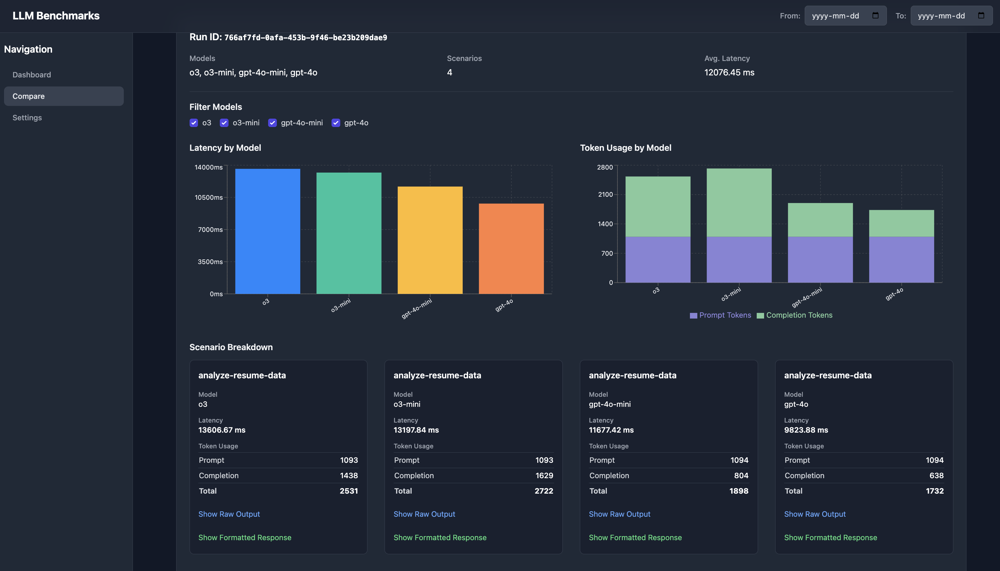

# LLM Usage Benchmark Viewer

## Screenshot



---

This is a starter project built with React, Vite, TypeScript, and Tailwind CSS that connects to a Supabase database to display and analyze LLM usage benchmarks. It provides a clean, responsive interface for viewing raw data and comparing performance across different models and scenarios.

## Key Features

*   **Modern Tech Stack**: React, Vite, TypeScript, and Tailwind CSS.
*   **Supabase Integration**: Securely connects to a Supabase project to fetch data using the official SDK.
*   **Dashboard View**: A table displaying all benchmark records from the `llm_usage_benchmark` table.
*   **Comparison View**: A powerful interface to group benchmark runs by `run_id`, allowing for side-by-side comparison of different models.
    *   **Dynamic Charts**: Visualizes latency and token usage per model for each run.
    *   **Model Filtering**: Interactively select which models to include in the comparison.
    *   **Detailed Breakdown**: View individual scenario results within each run.
*   **Data Parsing**: Intelligently parses LLM output to display token usage and formatted responses.
*   **Global Date Filter**: Filter the data across all views by a specific date range.
*   **Responsive Layout**: A professional application shell with a header, collapsible sidenav, and footer that works on all screen sizes.
*   **Modular Codebase**: Clean, organized, and component-based structure.

## Database Schema

The application is designed to work with the following table schema in your Supabase project:

```sql
create table llm_usage_benchmark (
  id uuid primary key default gen_random_uuid(),

  -- inserted from the Edge Function
  execution_id uuid not null, -- allows to locate record later
  input jsonb not null, -- raw input payload
  output jsonb, -- raw LLM response
  latency_ms double precision,

  -- inserted from the Node script
  run_id uuid, -- groups all scenario results for a single run
  model text, -- e.g. "gpt-4o"
  scenario_name text, -- filename or label

  created_at timestamptz default now()
);
```

## Getting Started

Follow these steps to get the project running locally.

### 1. Clone the Repository

```bash
git clone <your-repository-url>
cd <repository-directory>
```

### 2. Set Up Environment Variables

Create a `.env.local` file in the root of the project by copying the example file:

```bash
cp .env.example .env.local
```

Open `.env.local` and add your Supabase project URL and `anon` key:

```
VITE_SUPABASE_URL="your-supabase-project-url"
VITE_SUPABASE_ANON_KEY="your-supabase-anon-key"
```

### 3. Install Dependencies

Install the project dependencies using npm:

```bash
npm install
```

### 4. Run the Development Server

Start the Vite development server:

```bash
npm run dev
```

The application should now be running on `http://localhost:5173`.

## Available Scripts

*   `npm run dev`: Starts the development server.
*   `npm run build`: Compiles the TypeScript code and builds the project for production.
*   `npm run lint`: Lints the codebase for errors and warnings.
*   `npm run preview`: Serves the production build locally for previewing.